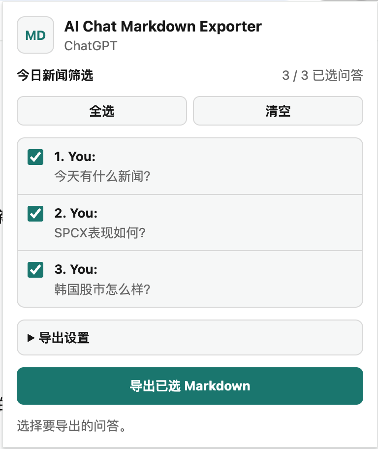

# AI Chat Markdown Exporter

Chrome extension for exporting the currently open ChatGPT, Claude, or Gemini conversation as a Markdown file.

Exports include an official link footer by default. The extension tries to detect public share URLs from the page; if none is visible, it uses the current conversation URL. You can also paste an official share URL in the popup before exporting.

The popup shows each user prompt as a checkbox item. Selecting a prompt exports that prompt and its following assistant answer. Export settings are grouped under a collapsed settings section and saved between popup sessions.

The settings panel includes extension-specific download settings, plus toggles for message timestamps, visible thought-process summaries, web-search sources, and Deep Research references. The download folder button uses Chrome's system directory picker when available and falls back to Chrome's download/save dialog when the browser does not support direct folder access.

## Preview



## Supported Sites

- ChatGPT: `chatgpt.com`, `chat.openai.com`
- Claude: `claude.ai`
- Gemini: `gemini.google.com`

## 使用说明

1. 运行 `npm run build` 生成扩展文件。
2. 打开 Chrome 的 `chrome://extensions` 页面。
3. 开启右上角的开发者模式。
4. 点击加载已解压的扩展程序，选择本项目的 `dist/` 文件夹。
5. 打开 ChatGPT、Claude 或 Gemini 中需要导出的对话页面。
6. 点击浏览器工具栏里的 AI Chat Markdown Exporter 图标。
7. 在弹窗中勾选需要导出的用户提问。每个勾选项都会导出该提问以及它对应的 AI 回答。
8. 如需调整导出内容，展开导出设置，可以选择下载文件夹，并开启或关闭时间戳、思考过程、网页搜索来源、Deep Research 引用、元信息和官方链接。
9. 点击导出 Markdown，扩展会将选中的对话保存为 `.md` 文件。

如果当前 Chrome 环境不支持直接选择下载文件夹，扩展会自动退回到 Chrome 自带的下载或保存对话框。

## Usage

1. Run `npm run build` to generate the extension files.
2. Open Chrome at `chrome://extensions`.
3. Enable Developer mode in the top-right corner.
4. Click Load unpacked and select this project's `dist/` folder.
5. Open the ChatGPT, Claude, or Gemini conversation you want to export.
6. Click the AI Chat Markdown Exporter icon in the browser toolbar.
7. Select the user prompts you want to export in the popup. Each selected item exports that prompt and its matching AI answer.
8. To customize the export, open Export Settings. You can choose a download folder and toggle timestamps, thought-process summaries, web-search sources, Deep Research references, metadata, and official links.
9. Click Export Markdown. The extension saves the selected conversation content as a `.md` file.

If the current Chrome environment does not support direct folder selection, the extension automatically falls back to Chrome's built-in download or save dialog.

## Development

```bash
npm run icons
npm run check
npm test
npm run build
```

Load the built extension from `dist/`:

1. Open `chrome://extensions`.
2. Enable Developer mode.
3. Click Load unpacked.
4. Select this project's `dist/` directory.

## Notes

The extension exports the currently open conversation. It reads visible page content from the browser DOM and does not call private backend APIs.
